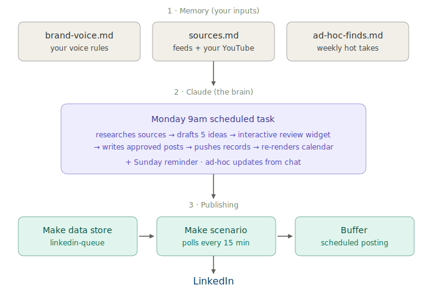

# LinkedIn Post Agent

> A personal AI agent that ships 4–5 LinkedIn posts a week in your voice. Built with Claude Cowork + Make + Buffer. **Free to run.**



**Watch the build:**  https://youtu.be/UUp6oizwncQ
---

## What it does

Every Monday at 9am, the agent:

1. Reads your **brand voice doc** (3–5 of your own posts trained the voice)
2. Pulls fresh angles from **your YouTube channel + a list of GTM sources you maintain**
3. Drafts **5 distinct post ideas** in your voice (different formats, different sources)
4. Shows them to you in an **interactive review widget** — approve / edit / skip / cancel each
5. Writes the full posts, assigns random 8–10am times across the week, and pushes them into a **Make data store**
6. Make polls the data store every 15 min and schedules each post in **Buffer**
7. Buffer publishes to LinkedIn at the exact scheduled time

You spend **~5 minutes a week** reviewing the widget. The agent handles the rest.

---

## What's in this repo

| File | What it is |
|---|---|
| [`SETUP.md`](./SETUP.md) | 6-step quickstart (~1 hour, $0) |
| [`01-brand-voice-TEMPLATE.md`](./01-brand-voice-TEMPLATE.md) | Fill-in-the-blank voice doc |
| [`02-sources-TEMPLATE.md`](./02-sources-TEMPLATE.md) | Source-monitoring list (tools, newsletters, your own channels) |
| [`03-ad-hoc-finds-TEMPLATE.md`](./03-ad-hoc-finds-TEMPLATE.md) | Empty scratchpad for the week's hot takes |
| [`04-monday-task-prompt.md`](./04-monday-task-prompt.md) | The full Claude scheduled-task prompt (12 steps) |
| [`05-data-store-schema.md`](./05-data-store-schema.md) | Field-by-field schema for the Make data store |
| [`06-make-scenario-walkthrough.md`](./06-make-scenario-walkthrough.md) | The 3-module Make scenario, with pitfalls |
| [`architecture.svg`](./architecture.svg) | The architecture diagram (above) |

---

## Quick start

```bash
git clone https://github.com/FrankiChamaki/linkedin-post-agent.git
cd linkedin-post-agent
open SETUP.md
```

Then follow `SETUP.md`. The build is ~1 hour. After that, ~5 min/week.

---

## Prerequisites

- A [Claude Cowork](https://claude.ai) account (free)
- A [Make.com](https://make.com) account (free — 1,000 ops/mo, ample for daily posts)
- A [Buffer](https://buffer.com) account (free — 3 channels)
- A LinkedIn profile
- 3–5 of your own existing LinkedIn posts (for voice training)
- ~1 hour

**Total cost: $0/month** to start.

---

## Two important pitfalls (don't skip)

1. **Use the Data Store trigger, not a Webhook trigger** on the Make scenario. A webhook-triggered scenario can't be driven by Claude via MCP. The data-store approach lets Claude push records programmatically without curl or browser automation.
2. **In Make's Search records module, set "Continue execution even if no results = Yes."** Otherwise Make emails you a "no results" error every 15 minutes forever.

Full pitfall list and fixes are inline in [`06-make-scenario-walkthrough.md`](./06-make-scenario-walkthrough.md).

---

## Architecture in one paragraph

Three markdown files (`brand-voice`, `sources`, `ad-hoc-finds`) hold your inputs. A Claude scheduled task fires every Monday 9am, reads those files, researches the week's GTM news, generates 5 idea cards, shows them to you in an interactive review widget, and on submit pushes the approved drafts into a Make data store. Make polls that data store every 15 min and queues each post in Buffer with the exact scheduled time. Buffer publishes to LinkedIn. Total cost: $0.

---

## Extending to X, Threads, BlueSky

The Make-side architecture is identical — just clone the scenario, point Buffer's profile at your X/Threads/BlueSky handle, create a separate data store per channel. The Claude side needs one brand-voice doc per channel (X voice ≠ LinkedIn voice) and either one consolidated Monday task or one task per channel.

---

## License

MIT — see [LICENSE](./LICENSE). Fork it, ship it, ship a better one.

**Tag me on LinkedIn if you build it** — [@FrankiChamaki](https://www.linkedin.com/in/frankichamaki/) — I want to see your version.

---

## Credits

Built by Franki Chamaki ([GTM Sprint](https://gtmsprint.run)) with Claude Cowork.
